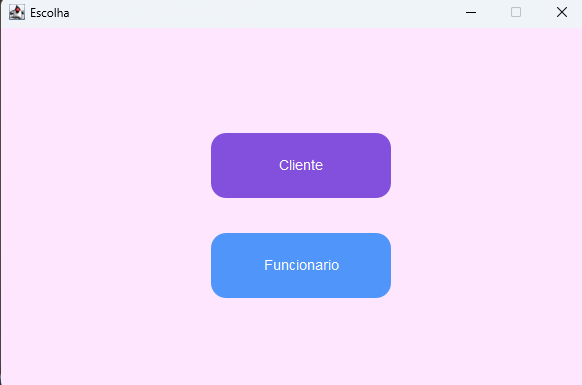
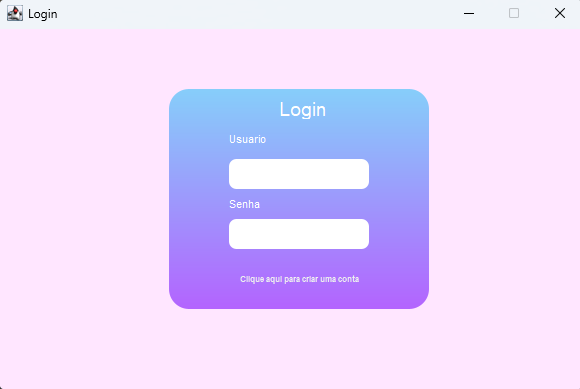
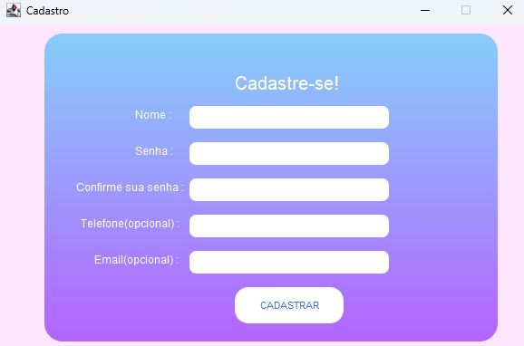
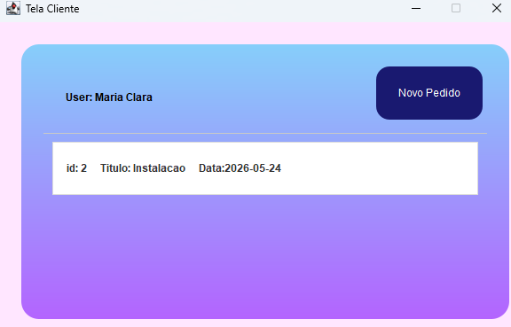
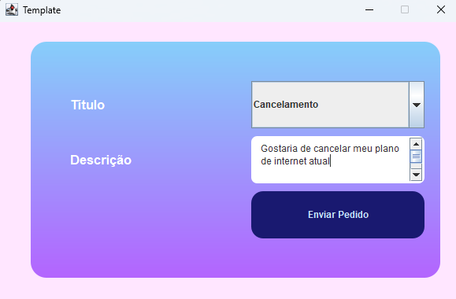
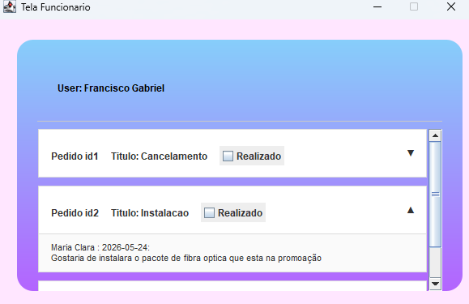

# App de Gerenciamento de Suporte de Computadores

Sistema Desktop em Java para controle, abertura e resolução de chamados técnicos de TI. O projeto utiliza consumo de API REST externa e conta com uma interface moderna e customizada via Java 2D.

## Problemática
O gerenciamento tradicional de ordens de serviço de informática baseado em planilhas, anotações físicas ou canais de comunicação descentralizados (como aplicativos de mensagem e e-mails) gera severos gargalos operacionais. Esse cenário resulta na falta de padronização dos dados coletados, perda de prazos de atendimento e dificuldade crônica no diagnóstico de falhas repetitivas pela equipe de TI. Além disso, a ausência de uma fila centralizada impede os técnicos de priorizarem chamados críticos com eficiência, enquanto os usuários finais sofrem com a falta de transparência, sem um canal direto para acompanhar o progresso das suas solicitações em tempo real.

## Solução
A aplicação resolve essa lacuna centralizando todo o ciclo de vida de um chamado de suporte técnico em uma única plataforma automatizada, integrada de forma assíncrona a um banco de dados remoto via API REST. O sistema fornece interfaces seguras e distintas para cada perfil de usuário:
* Painel do Cliente: Permite que usuários comuns efetuem cadastros validados, enviem descrições detalhadas de problemas vinculadas a níveis de urgência dinâmicos e consultem seu histórico individual de chamados ativos e encerrados.
* Módulo Administrativo: Disponibiliza aos funcionários de TI uma fila de atendimento organizada por prioridades, dotada de recursos visuais expansíveis para leitura ágil do escopo do problema e mecanismos imediatos para encerramento e baixa de ordens de serviço.

## Interface Visual Customizada (Look & Feel)
Para contornar o design padrão do Swing, o projeto renderiza seus próprios componentes de forma nativa utilizando a biblioteca gráfica java.awt.Graphics2D:
* Suavização Visual: Bordas e cantos arredondados suavizados através do recurso de antialiasing (KEY_ANTIALIASING).
* Design Moderno: Superfícies e painéis estilizados com degradê vertical harmônico (GradientPaint).
* Microinterações: Botões e componentes reativos que alteram de cor com a presença do cursor do mouse (MouseAdapter).

## Tecnologias e Dependências
* Ambiente de Execução: OpenJDK 25
* Bibliotecas Integradas: Pacote nativo org.json acoplado diretamente na árvore do projeto para parsing de payloads das APIs (APIData e APICad).
* Framework Gráfico: Java Swing (javax.swing) estruturado sob layouts mistos (null e GridLayout).

## Conceitos de POO Aplicados
* Superclasses e Herança: Centralização de propriedades geométricas e inicialização de janelas através da classe base abstrata Template.
* Polimorfismo de Sobrescrita (Method Overriding): Customização de componentes visuais do ecossistema Java através da sobrescrita do método paintComponent nas classes filhas (BotaoArredondado, PainelArredondado, CampoArredondado).
* Polimorfismo de Sobrecarga (Method Overloading): Utilização de múltiplos construtores em classes de interface para permitir a inicialização de janelas com comportamentos parametrizados distintos conforme o contexto da chamada (ex: variação de argumentos de login e tipos de acesso).
* Encapsulamento Baseado em Regras: Proteção de estados internos do sistema por meio de checagens obrigatórias, como as validações de tamanho mínimo de string na criação de credenciais e travas contra campos vazios na abertura de chamados.
* Enums Estruturados: Uso do enumerador Prioridades alimentando caixas de seleção dinâmica (JComboBox), mapeando textualmente as exibições e extraindo pesos numéricos de urgência através do método encapsulado getUrgencia().
* Tratamento de Exceções Customizadas: Arquitetura desacoplada de erros mapeando falhas de rede vs. falhas de autenticação (ConectException, DataException, LoginException).

## Estrutura Estrutural do Projeto
```text
├── assets/         # Conexões com as APIs, exceções e regras de negócio
├── Interface/      # Telas (Clientes, Técnicos, Cadastro, Janelas Base e Customizações)
├── org/json/       # Biblioteca org.json embutida nativamente no escopo
├── src/            # Código fonte do projeto
├── Main.java       # Ponto de entrada (Classe Principal)
└── README.md       # Documentação do sistema
```

## Arquitetura de Código (Exemplo Prático)

O trecho de código abaixo exemplifica o polimorfismo e a biblioteca Java 2D aplicados para construir a interface customizada do projeto:

```java
// Implementação presente na classe Custom.java
class PainelArredondado extends JPanel {
    @Override
    protected void paintComponent(Graphics g) {
        if (desenharFundo) {
            Graphics2D g2 = (Graphics2D) g.create();
            // Ativa o efeito de suavização nos cantos do painel
            g2.setRenderingHint(RenderingHints.KEY_ANTIALIASING, RenderingHints.VALUE_ANTIALIAS_ON);
            
            // Define o degradê vertical do topo ao rodapé do componente
            GradientPaint gp = new GradientPaint(0, 0, new Color(135, 206, 250), 0, getHeight(), new Color(180, 100, 255));
            g2.setPaint(gp);
            g2.fillRoundRect(0, 0, getWidth(), getHeight(), 40, 40);
            g2.dispose();
        }
        super.paintComponent(g);
    }
}
```
## Capturas de Tela

| Escolha de Perfil | Tela de Acesso (Login) | Formulário de Cadastro |
| :---: | :---: | :---: |
|  |  |  |

| Painel do Cliente | Formulário de Pedido | Painel do Funcionário |
| :---: | :---: | :---: |
|  |  |  |


## Como Executar o Projeto

### Opção 1: Via IntelliJ IDEA (Recomendado)
1. Certifique-se de possuir o JDK 25 configurado no seu ambiente.
2. Clone este repositório:
   ```bash
   git clone https://github.com
   ```
3. Abra a pasta do projeto diretamente na IDE. O IntelliJ indexará as pastas assets, Interface e org.json automaticamente.
4. Abra o arquivo Main.java e execute a aplicação clicando no botão Run (Play verde).

### Opção 2: Via Terminal
Abra o terminal na raiz do diretório clonado e execute os comandos de compilação:
```bash
# Compilar todas as classes do ecossistema respeitando os escopos dos pacotes
javac Main.java assets/*.java assets/Exceptions/*.java Interface/*.java org/json/*.java

# Inicializar o sistema
java Main
```

## Integrantes do Trabalho

- **[Francisco Gabriel Silveira](https://github.com/Fratis35)**
- **[João Manuel](https://github.com/JoaoManoel22)**
- **[Renan Soares](https://github.com/RenanSoaresSouza)**

